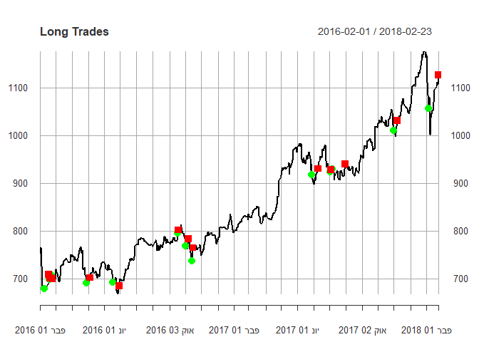

Stocks Market Prediction-classification in R
================
Ori Dahari  
Feb 2018

Abstract:
---------

#### Predict the stock's behavior from S&P 500 Index at different times (over 1, 30 and 60 days) in order to see if the stock price will rise.

#### Comperes classification models such as RF, GBM, and logistic regression in order to get the best result for each Stocks

#### In this document, I will present an example of the process of constructing a forecasting model for one Stock.

##### Feature engineering :Function that add to the data frame the Relations between variables

``` r
add.data.frame <- function(Split.df){

 
 #Change between yesterday close-today close
yesterday_closePrice= shift(v=as.numeric(Split.df$Close), places=1, dir="right")
Change= (Split.df$Close-yesterday_closePrice)/yesterday_closePrice*100
Change[1]=0

  #Change between yesterday close-today open price
Open_Change= (Split.df$Open-yesterday_closePrice)/yesterday_closePrice*100
Open_Change[1]=0

#Change between yesterday todey open-today close price
Change_Within= Change-Open_Change

#Ratio between high,low,open,close
High_Close= Split.df$High/Split.df$Close

Low_Close=  Split.df$Low/ Split.df$Close

High_Low=  Split.df$High/ Split.df$Low

High_Open=  Split.df$High/ Split.df$Open

Low_Open=  Split.df$Low/ Split.df$Open

EMA.Fast <- EMA(Split.df$Close, n=20)
EMA.Medium <- EMA(Split.df$Close, n=120) 
EMA.Slow <- EMA(Split.df$Close, n=200) 
EMA.10=  EMA(Split.df$Close, n=10)
EMA.50= EMA(Split.df$Close, n=50)
EMA.80= EMA(Split.df$Close, n=80)
EMA.100= EMA(Split.df$Close, n=100)
EMA.150= EMA(Split.df$Close, n=150)
fast_detrend_ma <- EMA.Fast - EMA.Medium
slow_detrend_ma <- EMA.Medium - EMA.Slow
CCI.IND <- CCI(HLC=Split.df[,c("High","Low","Close")],n=100)
RSI.Fast <- RSI(price=Split.df$Close,n=10)
RSI.Slow <- RSI(price=Split.df$Close,n=100)
RSI.Medium= RSI(price=Split.df$Close,n=30)
RSI.14= RSI(price=Split.df$Close,n=14)
RSI.50= RSI(price=Split.df$Close,n=50)
RSI.80= RSI(price=Split.df$Close,n=80)
RSI.Diff.Med <- RSI.Medium-RSI.Slow
RSI.Diff.Fast <- RSI.Fast-RSI.Medium
ROC.Fast <- ROC(Split.df$Close,n=10)
ROC.Medium <- ROC(Split.df$Close,n=100)
ROC.Slow <- ROC(Split.df$Close,n=200)
ROC.Diff <- ROC.Fast-ROC.Medium
ROC.Diff.Medium <- ROC.Medium-ROC.Slow
CV.IND=chaikinVolatility(HL=Split.df[,c("High","Low")],n=100)

Split.df <- data.frame(Split.df[],Change,Open_Change,Change_Within,High_Close,Low_Close,High_Low,High_Open,Low_Open,EMA.Fast,EMA.Medium,EMA.Slow, fast_detrend_ma,slow_detrend_ma,CCI.IND,RSI.Fast,RSI.Slow,RSI.Diff.Med,RSI.Diff.Fast,ROC.Fast,ROC.Slow,ROC.Diff,EMA.10,EMA.50,EMA.80,EMA.100,EMA.150,CV.IND,RSI.14,RSI.50,RSI.80,RSI.Medium,ROC.Medium,ROC.Diff.Medium)


return(Split.df)
  
}
```

##### Feature engineering: Add to data frame more technical indicators of the stock

``` r
addInd<- function(data2){
  
    data2$LogClose <- log(data2$Close)  
  data2$MACD <- MACD(data2$Close)
 data2$will <- williamsAD(data2[,c("High","Low","Close")])
 data2$cci <-  CCI(data2[,c("High","Low","Close")])
 data2$STOCH <- stoch(data2[,c("High","Low","Close")])
 data2$Aroon <- aroon(data2[, c("High","Low")])
 data2$ATR <- ATR(data2[,c("High","Low","Close")]) 
data2$stoch<-stoch(data2[, c("High","Low","Close")], nFastK = 14,nFastD = 3,nSlowD = 3,bounded = TRUE,smooth = 1)
data2$obv=OBV(data2[, c("Close")],data2[, c("Volume")])
 data2$SMI <- SMI(data2[, c("High","Low","Close")])
 data2$BB <- BBands(data2[, c("High","Low","Close")])
 data2$ChaikinVol <-Delt(chaikinVolatility(data2[, c("High","Low")]))
 data2$CLV <- EMA(CLV(data2[, c("High","Low","Close")]))
 data2$Volatility <- volatility(data2[, c("Open","High","Low","Close")], calc="garman")
  
 return(data2)
  
}
```

##### Function that compute the Y prediction - The range we are trying to predict, whether the share will rise within that range:

``` r
computeY <- function(df){
 boolean=FALSE
  
     closePriceXdays=shift(v=as.numeric(df$Close ), places=1, dir="left")
       boolean = (closePriceXdays-df$Close)/df$Close*100>0
    
  vectorY=ifelse(boolean ,1,0)
  
 return( vectorY )
  
  
}
```

##### Calculate the Profit and Loss using the predict model:

``` r
ProfitLoss_Calculator <- function(objDF) {
        # make column names generic so they can handle any symbol
        
        
        current_long <- 0
        current_short <- 0
        
        for (ind in seq(1,nrow(objDF))) {
                if (!is.na( objDF$Long_Trades[ind])) {
                        # first trade should be an entry, last trade an exit
                        if ((current_long==0 & objDF$Long_Trades[ind] > 0) | (current_long !=0)) {
                                # next trade should be opposite sign of previous trade (entry -> exit)
                                if (sign(objDF$Long_Trades[ind]) != sign(current_long)) {
                                        current_long <- as.numeric(objDF$Long_Trades[ind])
                                        print(paste('Long', current_long))
                                }
                        }
                
                        if (current_long != as.numeric(objDF$Long_Trades[ind]))
                                objDF$Long_Trades[ind] <- 0
                }
       
          
              #  if (objDF$Short_Trades[ind] !=0) {
                        # first trade should be an entry
               #         if ((current_short==0 & objDF$Short_Trades[ind] > 0) | (current_short !=0)) {
                                # next trade should be opposite sign of previous trade (entry -> exit)
                #                if (sign(objDF$Short_Trades[ind]) != sign(current_short)) {
                 #                       current_short <- as.numeric(objDF$Short_Trades[ind])
                  #                      print(paste('Short', current_short))
                   #             }
                    #    }
                     #   if (current_short != as.numeric(objDF$Short_Trades[ind]))
                      #          objDF$Short_Trades[ind] <- 0
                }
 
        
        # trim to be even, if not add last close held in chart
        if ((!length(objDF$Long_Trades[objDF$Long_Trades != 0])%% 2) == 0){
               objDF$Long_Trades[length(objDF$Close)] <- -1 * objDF$Close[length(objDF$Close)]
               current_long=-1 * objDF$Close[length(objDF$Close)]
        }
      #  if ((!length(objDF$Short_Trades[objDF$Short_Trades != 0])%% 2) == 0)
      #         objDF$Short_Trades[length(objDF$Close)] <- -1 * objDF$Close[length(objDF$Close)]
      #  View(objDF$Long_Trades)
        print(paste('Final Longs:',round(sum(objDF$Long_Trades * -1 , na.rm = TRUE),2)))
     #   print(paste('Final Shorts:',round(sum(objDF$Short_Trades),2)))
        
        earn=(-1*current_long-(-1*current_long-(round(sum(objDF$Long_Trades * -1 , na.rm = TRUE),2))) ) / (-1*current_long-(round(sum(objDF$Long_Trades * -1 , na.rm = TRUE),2)))*100
        
        print(paste('yield:',earn))
        print(paste('yield per day:',earn/(length(objDF$Long_Trades)- sum(is.na(objDF$Long_Trades)))))
        # plot trade entries and exits
      #  par(mfrow=c(2,1))
        
        plot(objDF$Close ,main='Long Trades', subset="")
        events <- xts("80/20", 
              (c(index(MainStock[bound,]))))
        addEventLines(events, srt=90, pos=2,lty = 1, lwd = 1, col = 1)
        
        points(ifelse(objDF$Long_Trades > 0, objDF$Long_Trades, NA), col='green', cex=1.5, pch=16)
        points(ifelse(objDF$Long_Trades < 0, objDF$Long_Trades * -1, NA), col='red', cex=1.5, pch=15)
        
      #  plot(objDF, main='Short Trades')
       # points(ifelse(objDF$Short_Trades > 0, objDF$Short_Trades, NA), col='green', cex=1.5, pch=16)
        #points(ifelse(objDF$Short_Trades < 0, objDF$Short_Trades * -1, NA), col='red', cex=1.5, pch=15)
}
```

##### Prediction model to GOOGLE stock for example:

``` r
  upOrDown=c()
    symboll='GOOG'
  getSymbols(symboll, src='yahoo')
```

    ## 'getSymbols' currently uses auto.assign=TRUE by default, but will
    ## use auto.assign=FALSE in 0.5-0. You will still be able to use
    ## 'loadSymbols' to automatically load data. getOption("getSymbols.env")
    ## and getOption("getSymbols.auto.assign") will still be checked for
    ## alternate defaults.
    ## 
    ## This message is shown once per session and may be disabled by setting 
    ## options("getSymbols.warning4.0"=FALSE). See ?getSymbols for details.

    ## 
    ## WARNING: There have been significant changes to Yahoo Finance data.
    ## Please see the Warning section of '?getSymbols.yahoo' for details.
    ## 
    ## This message is shown once per session and may be disabled by setting
    ## options("getSymbols.yahoo.warning"=FALSE).

    ## [1] "GOOG"

``` r
    MainStock=na.omit(get(symboll))
        colnames(MainStock) <- c("Open", "High", "Low", "Close", "Volume", "Adj")
    Stock=MainStock
    
    ## preper the data:
    Stock=addInd(Stock)
    Stock=add.data.frame(Stock)
    
    ##Choose what to predict (build Y)
    Stock$Up_Down=computeY(Stock)
    Stock=na.omit(Stock[1:(nrow(Stock)-1),])
    colUP_Down=colnames(Stock)=='Up_Down'
    upOrDown= append(upOrDown, Stock[, colUP_Down])
   
    form <- Stock$Up_Down ~ .^2
    options(na.action="na.pass")
    Stock = model.matrix(form, data = Stock)
    Stock=Stock[,-c(1)]
    
 

      ##PCA - 
      
      pc = prcomp(Stock, center = TRUE, scale. = TRUE) 
      pc.var =pc$sdev ^2
      pc.per = pc.var[1:350]/sum(pc.var)
      #plot(pc.per[1:350])
      
      Up_Down=upOrDown
      Stock<-data.frame(Up_Down,pc$x[,1:30])
      
         # Split to train 80% and test 20%
       bound <- floor((nrow(Stock)/5)*4)
       df.train <- Stock[1:bound, ]
       df.test <- Stock[(bound+1):nrow(Stock), ]
```

##### Random Forest

``` r
      set.seed(9) #RF includes random selection. Repeat same seed to repeat the RF
    Stock.RF <- randomForest(factor(Up_Down) ~. , data = df.train ,na.action=na.exclude) #Train with all predictors
    fitted.results.RF=predict(Stock.RF,df.test, type = "prob")
    # summary(fitted.results.RF)
     # plot(Stock.RF)
    #importance(Stock.RF)
    # varImpPlot(Stock.RF)
    
    threshold <- 0.6
    prediction <- ifelse(fitted.results.RF[,2] > threshold,1,0)
 

    cross.table <- table(prediction, df.test$Up_Down )
  
    
    ###calculate all KPIs:
    
    acc=(cross.table[1,1]+cross.table[2,2])/ (cross.table[1,1]+cross.table[2,2]+cross.table[1,2]+cross.table[2,1]) #accuracy 
    prec=cross.table[2,2]/(cross.table[2,2]+cross.table[2,1]) #precision
    rec=cross.table[2,2]/(cross.table[2,2]+cross.table[1,2]) #Recall
    
    summary_data=data.frame(Accuracy=acc ,Precision=prec , Recall=rec)
   summary_data
```

    ##    Accuracy Precision     Recall
    ## 1 0.4587332 0.7777778 0.02439024

``` r
   cross.table
```

    ##           
    ## prediction   0   1
    ##          0 232 280
    ##          1   2   7

##### GLM

``` r
#GLM
    
    Stock.logit <- glm(Up_Down ~ ., data = df.train, family = binomial)
    fitted.results.logit <- predict(Stock.logit,df.test,type='response')
    threshold <- 0.6
    prediction <- ifelse(fitted.results.logit > threshold,1,0)
    cross.table.logit <- table(prediction, df.test$Up_Down )
  
        acc.logit=(cross.table.logit[1,1]+cross.table.logit[2,2])/ (cross.table.logit[1,1]+cross.table.logit[2,2]+cross.table.logit[1,2]+cross.table.logit[2,1]) #accuracy 
    prec.logit=cross.table.logit[2,2]/(cross.table.logit[2,2]+cross.table.logit[2,1]) #precision
    rec.logit=cross.table.logit[2,2]/(cross.table.logit[2,2]+cross.table.logit[1,2]) #Recall
    
    summary_data.logit=data.frame(Accuracy=acc.logit ,Precision=prec.logit , Recall=rec.logit)
    cross.table.logit
```

    ##           
    ## prediction   0   1
    ##          0 209 242
    ##          1  25  45

``` r
    summary_data.logit
```

    ##   Accuracy Precision    Recall
    ## 1 0.487524 0.6428571 0.1567944

##### GBM

``` r
    threshold <- 0.6
    set.seed(7) #GBM includes random selection. Repeat same seed to repeat the RF
    Stock.GBM <- gbm (Up_Down ~ . , data = df.train, n.trees = 1000, interaction.depth = 4, shrinkage = 0.2, verbose = F) #gbm 
```

    ## Distribution not specified, assuming bernoulli ...

``` r
    fitted.results.GBM <- predict(Stock.GBM,df.test, n.trees = 1000, type="response")
      prediction.GBM <- ifelse(fitted.results.GBM > threshold,1,0)
 
    cross.table.GBM <- table(prediction.GBM, df.test$Up_Down )
    if((dim( cross.table.GBM)[1]+dim( cross.table.GBM)[2])==4){
   
    ###From the table you can calculate manualy all KPIs:
    
    acc.GBM=(cross.table.GBM[1,1]+cross.table.GBM[2,2])/ (cross.table.GBM[1,1]+cross.table.GBM[2,2]+cross.table.GBM[1,2]+cross.table.GBM[2,1]) #accuracy 
    prec.GBM=cross.table.GBM[2,2]/(cross.table.GBM[2,2]+cross.table.GBM[2,1]) #precision
    rec.GBM=cross.table.GBM[2,2]/(cross.table.GBM[2,2]+cross.table.GBM[1,2]) #Recall
    
    summary_data.GBM=data.frame(Accuracy=acc.GBM ,Precision=prec.GBM , Recall=rec.GBM)
    
    cross.table.GBM
    summary_data.GBM
}
```

    ##    Accuracy Precision   Recall
    ## 1 0.4932821 0.5628415 0.358885

##### Plot the result of the prediction:

``` r
df.test$prediction=prediction
df.train$prediction=df.train$Up_Down
df=merge(df.train,df.test, by="row.names",all = TRUE,join ='left')
df$prediction.y[is.na(df$prediction.y)] <- 1
df$prediction.x[is.na(df$prediction.x)] <- 1
df$joinPrediction=df$prediction.y*df$prediction.x

df <- xts(df[,-1], order.by=as.Date(as.character(df[,1]),"%Y-%m-%d"))
MainStock=merge(MainStock,df,all = TRUE)[,-c(7:70)]


   
# look for long entries
Long_Trades <- ifelse( MainStock$joinPrediction  == 1 ,MainStock$Close,NA)

Long_Trades <- ifelse(shift(v=as.numeric(MainStock$joinPrediction), places=1, dir="right")==1 & MainStock$joinPrediction==0  , -1 * MainStock$Close, Long_Trades)

#exit_Long_Trades <- ifelse(shift(v=as.numeric(Point), places=2, dir="right")==1& shift(v=as.numeric(Point), places=1, dir="right")==0 & Point==0  , MainStock$Close,NA)

# look for short entries
#Short_Trades <- ifelse(     Point==0, MainStock$Close, NA) 

MainStock$Long_Trades=Long_Trades
#MainStock$exitLong=exit_Long_Trades
ProfitLoss_Calculator(MainStock[c((nrow(MainStock)-length(df.test[,1])+1):nrow(MainStock)),])
```

    ## [1] "Long 678.109985"
    ## [1] "Long -708.400024"
    ## [1] "Long 697.349976"
    ## [1] "Long -700.909973"
    ## [1] "Long 706.460022"
    ## [1] "Long -699.559998"
    ## [1] "Long 691.02002"
    ## [1] "Long -701.429993"
    ## [1] "Long 691.719971"
    ## [1] "Long -684.109985"
    ## [1] "Long 795.26001"
    ## [1] "Long -801.5"
    ## [1] "Long 768.700012"
    ## [1] "Long -782.52002"
    ## [1] "Long 736.080017"
    ## [1] "Long -764.47998"
    ## [1] "Long 917.789978"
    ## [1] "Long -930.090027"
    ## [1] "Long 923.650024"
    ## [1] "Long -927.960022"
    ## [1] "Long 929.359985"
    ## [1] "Long -939.330017"
    ## [1] "Long 1010.169983"
    ## [1] "Long -1030.930054"
    ## [1] "Long 1055.800049"
    ## [1] "Final Longs: 196.54"
    ## [1] "yield: 21.1276529707299"
    ## [1] "yield per day: 0.254550035791927"


